<div align="center">

# Data Engineering A to Z

### 주니어에서 시니어까지

신입 데이터 엔지니어 **주니**가 시니어가 되기까지, 스크롤로 배우는 데이터 엔지니어링 입문<br>
코딩을 몰라도 괜찮아요 · 12개 장 · 약 35분

### [▶ 바로 보기](https://twenter1003.github.io/DE_web/)

[](https://github.com/twenter1003/DE_web/actions/workflows/pages.yml)


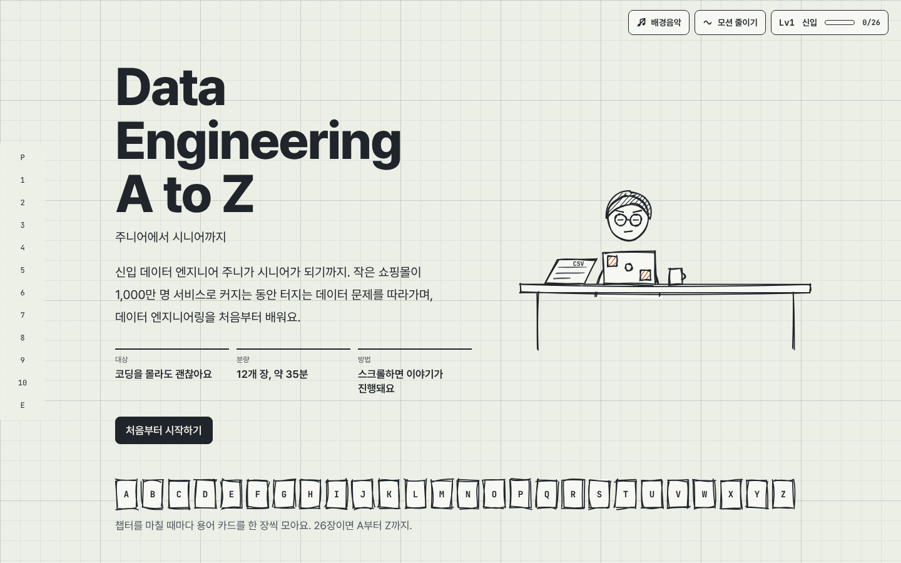

</div>

## 어떤 이야기인가요

가상의 쇼핑몰 '바구니'가 사용자 100명에서 1,000만 명으로 커지는 동안, 회사가 커질 때마다 데이터 문제가 터져요.
신입 주니는 매번 부딪히고, 실패하고, 개념을 배워 해결하면서 시니어로 자라요. 읽는 사람도 같은 순서로 데이터 엔지니어링의 핵심 개념을 A부터 Z까지 익혀요.

모든 장은 **문제 → 시도와 실패 → 개념 → 해결 → 퀴즈 → 성장** 순서로 흘러가요.

## 스크롤하면 그림이 움직여요

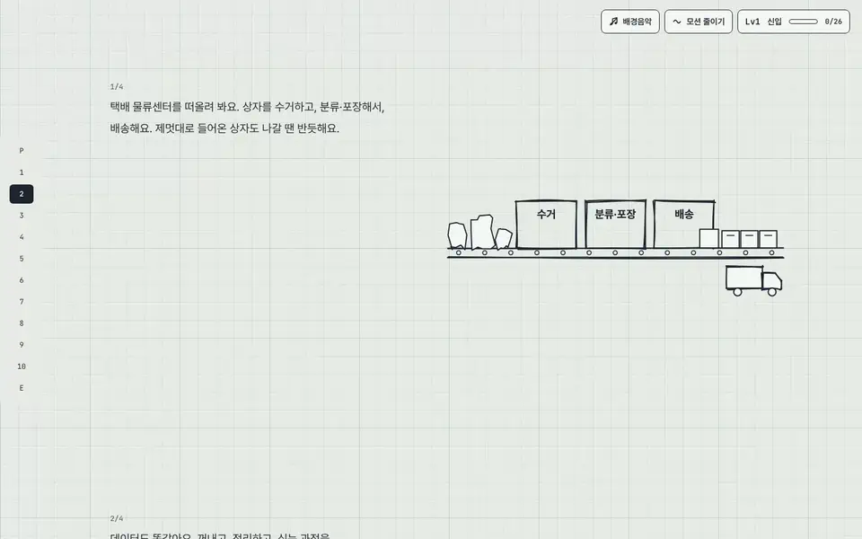

글을 읽으며 스크롤하면 옆의 그림이 한 단계씩 움직여요. 스크롤을 가로채지 않아서, 멈추면 그림도 그 자리에 멈춰요.
SQL 실행기, 파이프라인 코드 실행기, DAG 실패 시뮬레이터, 타임 트래블 슬라이더처럼 직접 눌러 보는 실험도 곳곳에 있어요.

## 12개 장

| 장 | 제목 | 배우는 것 | 바구니 규모 |
|---|---|---|---|
| Prologue | 데이터는 어디서 오는가 | 이벤트 로그와 트랜잭션, 데이터의 형태 | 사용자 100명 |
| Ch1 | “어제 몇 개 팔렸어요?” | SQL과 데이터베이스 | 사용자 100명 |
| Ch2 | 첫 파이프라인 | ETL과 배치 | 사용자 100명 |
| Ch3 | 새벽 3시의 장애 | 자동화와 오케스트레이션 | 사용자 1만 명 |
| Ch4 | 매출이 두 개예요 | 웨어하우스와 데이터 모델링 | 사용자 1만 명 |
| Ch5 | 데이터가 노트북에 안 들어가요 | 빅데이터와 분산 처리 | 사용자 100만 명 |
| Ch6 | 지금 이 순간 | 스트리밍 | 사용자 100만 명 |
| Ch7 | 월요일 아침, 매출이 0원 | 데이터 품질과 운영 | 사용자 100만 명 |
| Ch8 | 호수와 창고를 합치다 | 레이크하우스 | 사용자 1,000만 명 |
| Ch9 | 청구서와 개인정보 | 비용·보안·거버넌스 | 사용자 1,000만 명 |
| Ch10 | 시니어가 되는 순간 | 판단, 설계, 그리고 안 만드는 용기 | 사용자 1,000만 명 |
| Epilogue | 다시 A부터 | 전체 플랫폼, 그리고 순환 | 사용자 1,000만 명 |

## 스케치에서 설계도로

장이 넘어갈수록 선이 반듯해지고 배경이 제도 용지에서 블루프린트로 바뀌어요. 처음엔 손그림이던 파이프라인이 마지막엔 정밀한 설계도가 돼요.

| Ch3 · 종이 위 손그림 | Ch5 · 트레이싱지 |
|:---:|:---:|
| 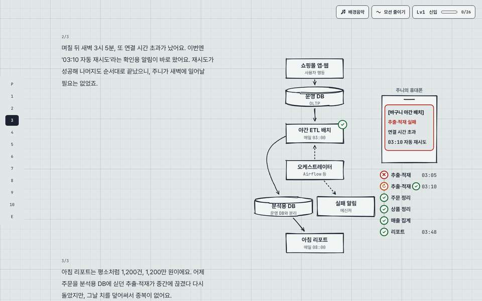 | 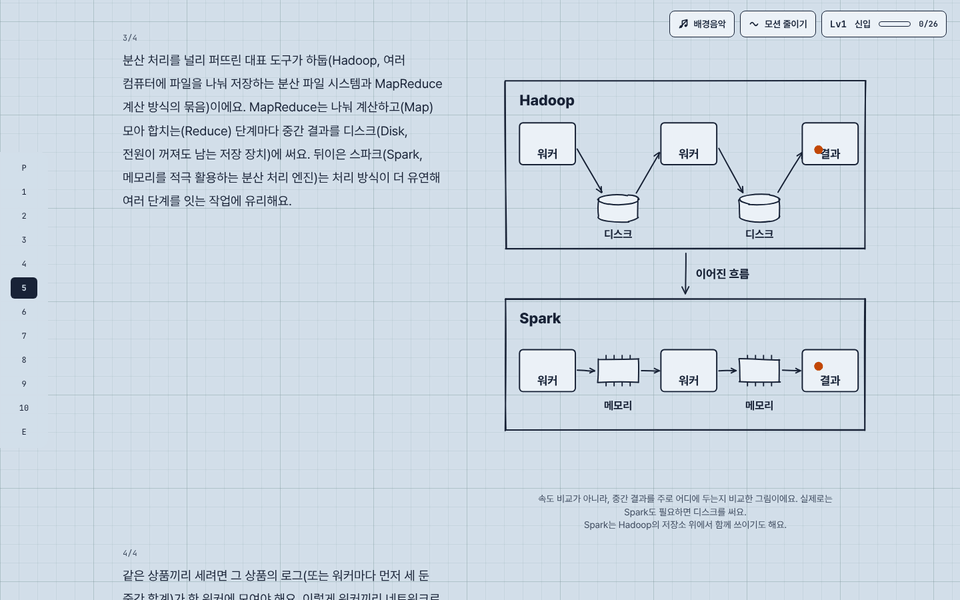 |
| **Ch10 · 설계도** | **Epilogue · 전체 플랫폼** |
| 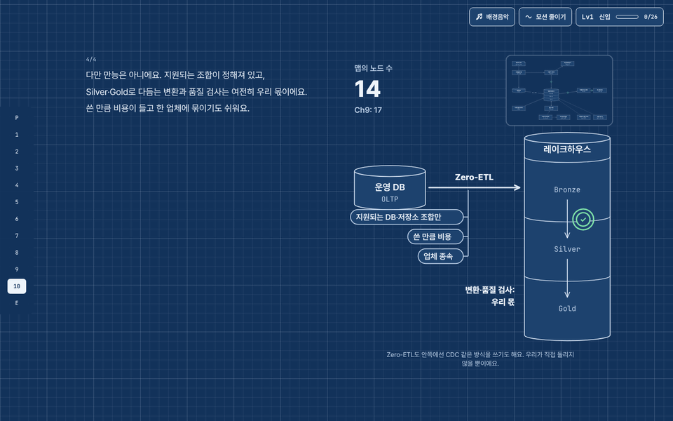 | 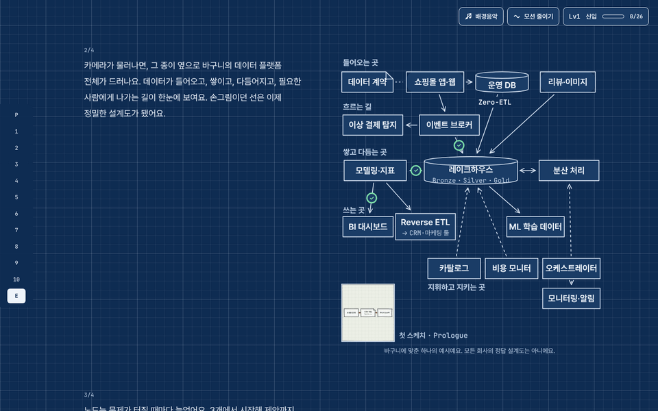 |

## 모으고, 자라요

| 성장 연출 | 주니의 기록 · 도감 |
|:---:|:---:|
| 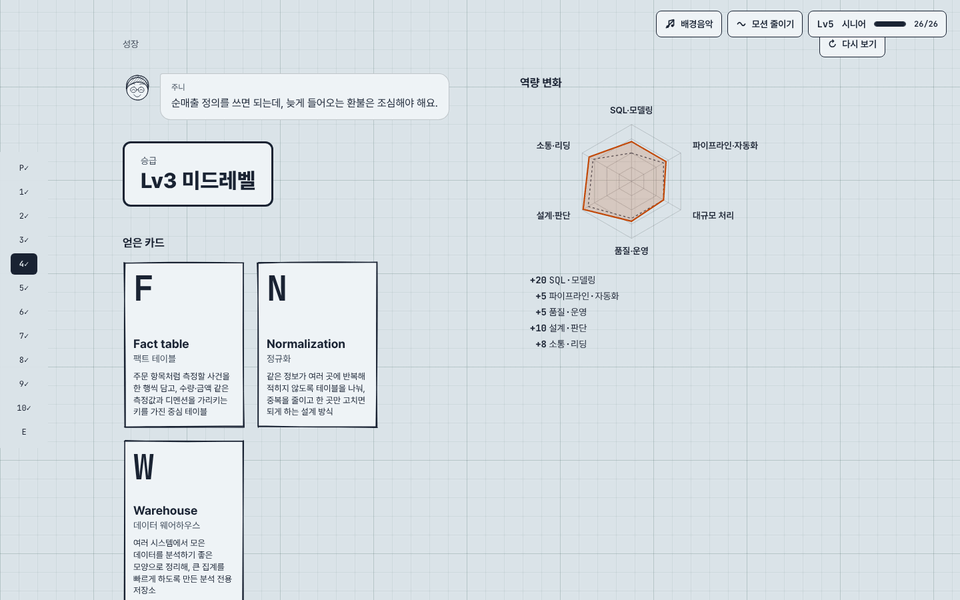 | 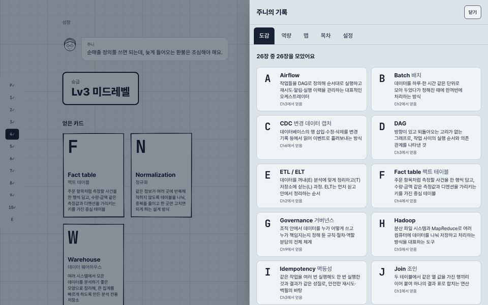 |

- Prologue부터 Ch10까지 장마다 퀴즈를 풀면 **A–Z 용어 카드**와 역량이 쌓이고, 레벨이 **Lv1 신입 → Lv2 주니어 → Lv3 미드레벨 → Lv4 시니어 직전 → Lv5 시니어**로 올라요.
- 화면 오른쪽 위의 기록 버튼을 누르면 도감, 역량 레이더, 지금까지 자란 파이프라인 맵, 목차를 볼 수 있어요.
- **파이프라인 맵**은 장마다 자라다가 Ch10에서는 오히려 단순해지고, 에필로그에서 전체 플랫폼으로 줌아웃해요.
- 진행도는 이 브라우저에 저장돼서, 다음에 와도 이어서 볼 수 있어요.

<details>
<summary>A–Z 카드 26장 보기</summary>

| | | | |
|---|---|---|---|
| **A** Airflow | **B** Batch | **C** CDC | **D** DAG |
| **E** ETL / ELT | **F** Fact table | **G** Governance | **H** Hadoop |
| **I** Idempotency | **J** Join | **K** Kafka | **L** Lineage |
| **M** Medallion | **N** Normalization | **O** OLTP vs OLAP | **P** Partitioning |
| **Q** Quality | **R** Reverse ETL | **S** Schema | **T** Time travel |
| **U** Unstructured data | **V** 3V | **W** Warehouse | **X** eXactly-once |
| **Y** YAML | **Z** Zero-ETL | | |

</details>

## 휴대폰에서도, 누구나

<p align="center">
  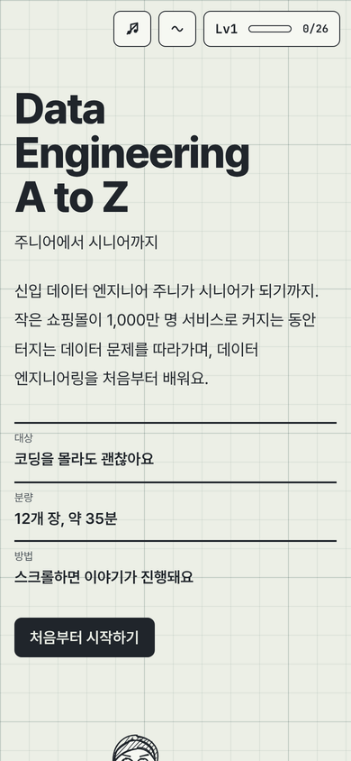
  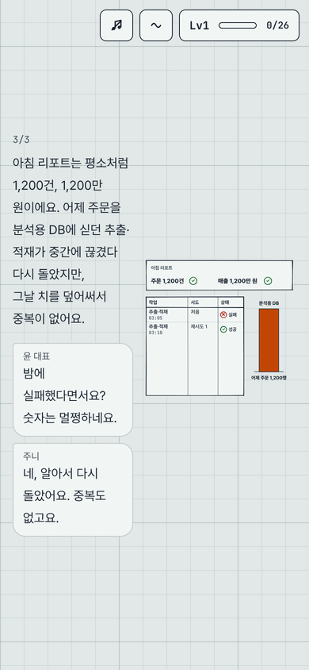
  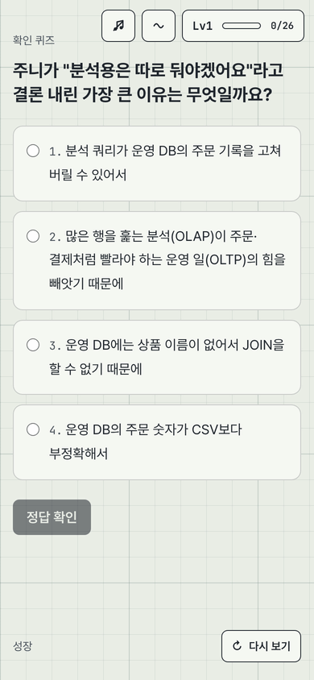
</p>

- 휴대폰에서도 웹과 같은 배치예요. 왼쪽 글을 스크롤하면 오른쪽 그림이 따라 움직여요.
- **모션 줄이기**(시스템 설정 또는 오른쪽 위 토글)를 켜면 단계마다 정지 그림과 글로 바뀌어요. 배우는 내용은 똑같아요.
- 키보드만으로 퀴즈·도감·설정을 모두 다룰 수 있고, 그림마다 화면 낭독기용 설명이 있어요.
- **배경음악**은 브라우저가 그 자리에서 만들어 내는 음악이에요(음원 파일 없음). 기본은 꺼져 있고, 이야기가 진행될수록 악기가 하나씩 늘어나요.

## 실행

Node.js 20 이상이 필요해요.

```bash
npm install
```

```bash
npm run dev
```

브라우저에서 터미널에 표시된 주소(기본 `http://localhost:5173`)를 열어요. 다른 포트를 쓰려면 `npm run dev -- --port 5288`.

## 빌드와 배포

```bash
npm run build
```

`dist/`에 정적 파일이 만들어져요. 빌드는 상대 경로(`base: './'`)라서 어느 경로에 올려도 동작해요. `npm run preview`로 빌드 결과를 미리 볼 수 있어요.

- **Vercel**: 저장소를 가져오면 Vite 프로젝트로 인식해요. Build Command `npm run build`, Output Directory `dist`.
- **GitHub Pages**: `main`에 push하면 `.github/workflows/pages.yml`이 빌드해서 배포해요(저장소 Settings → Pages의 Source = GitHub Actions). 지금 배포 주소: https://twenter1003.github.io/DE_web/

## 구조

```
src/content/      모든 문구(본문·대사·퀴즈·카드·버튼)
src/chapters/     챕터 = 독립 컴포넌트 + 자체 타임라인 (registry.ts 에 순서)
src/components/   공통 부품: StepScene(모션 문법), PipelineMap, Quiz, ChapterGrowth, Hud, Desk, Rough* …
src/state/        진행도(localStorage), 모션 줄이기·모바일 감지(gsap.matchMedia), 레벨·역량·맵 파생
src/lib/          스테이지 팔레트·선 정밀도, gsap 등록, rough.js 래퍼
docs/             ARCHITECTURE(설계), CHAPTER_GUIDE(챕터 구현), STORYBOARD(장면 기획), CONTENT_REVIEW(콘텐츠 검수), readme(README 이미지)
scripts/          contrast.mjs(팔레트 대비 검증), shot.mjs(스크린샷), scrollcheck.mjs(전체 스크롤 점검), storyboard.mjs
```

자세한 설계와 규칙은 `docs/ARCHITECTURE.md`와 `docs/CHAPTER_GUIDE.md`에 있어요.

## 사용한 것

React 19, TypeScript, Vite, Tailwind CSS 4, GSAP·ScrollTrigger, rough.js. 글꼴은 Pretendard와 JetBrains Mono(둘 다 SIL Open Font License).
바구니와 등장인물은 모두 가상이고, 도구 이름은 대표적인 예시로만 소개했어요.
